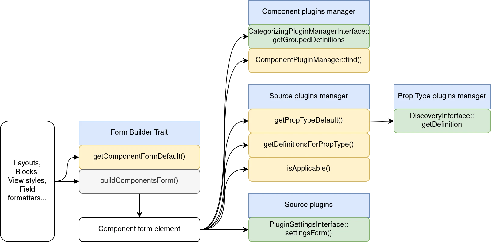

# Internals

> ⚠️ **DRAFT: work in progress**

UI Patterns 2 is doing 3 jobs.

## Guessing the PropType plugin for every components' props.

Schema compatibility checker:

```
src/SchemaManager/
├── Canonicalizer.php
├── CompatibilityChecker.php
├── ReferencesResolver.php
├── ScalarCompatibilityTrait.php
└── StreamWrapper.php
```

For implicit prop type declaration. UI Patterns must work with every SDC component, even the ones not built with UI Patterns. So, if a component is not using a direct reference to a prop type plugin, we can guess the prop type.


## Building a form for each component by loading Source plugins



### Components

```yaml
source_id: component
source:
  component:
    component_id: "ui_suite_bootstrap:accordion"
    slots: {}
    props: {}
```

Each slot can have one or many sources. Each prop can have only one source.

### Widgets

The stored data is the same as the data send to prop or slots.

```yaml
source_id: wysiwyg
source:
  value:
    value: "Lorem ipsum dolor sit amet"
    format: basic_html
```

```
          source_id: select
          source:
            value: container
```

```yaml
source_id: selects
source:
  value:
    - "12"
    - "12"
```

```yaml
source_id: checkbox
source:
  value: 1
```

### "Normal" data sources

```yaml
source_id: entity_link
source:
  template: devel-load
  absolute: 0
```

### Sources of sources

```yaml
source_id: block
source:
  plugin_id: system_branding_block
  system_branding_block:
    id: system_branding_block
    use_site_name: false
    use_site_slogan: false
```

```yaml
plugin_id: "system_menu_block:account"
"system_menu_block:account":
  id: "system_menu_block:account"
  label: "User account menu"
  label_display: "1"
  provider: system
  level: 1
  depth: 1
  expand_all_items: false
```

### Context switchers

Context switchers

```yaml
source_id: entity_reference
source:
  derivable_context: entity_reference:node:article:uid:user:user
  entity_reference:node:article:uid:user:user:
    value:
      sources: []
```

```yaml
source_id: entity_field
source:
  derivable_context: field:user:user:user_picture
  field:user:user:user_picture:
    value:
      sources: []
```

Some are derived:

```yaml
source_id: entity:field_property:user:user_picture:target_id
source:
  derivable_context: entity_reference:user:user:user_picture:file:file
  entity_reference:user:user:user_picture:file:file:
    value:
      sources: []
```

They all inherit

## Building a renderable from the component form data


